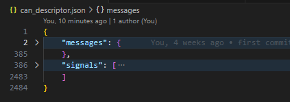
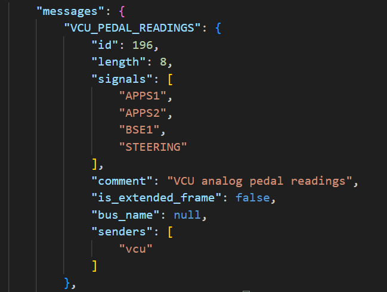
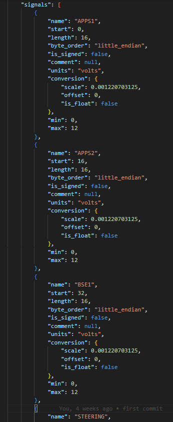

# Kennesaw Motorsports DBC generator repo

this repository contains all of the the files which define the CAN bus traffic on both the IC and EV platform.

contact @mathbrook with any issues

```dbc-files``` contains the EV motor controller DBC file, the IC ECU DBC file, and the EV BMS DBC file, if you add to this update the default.nix file to reflect it.

```can_descriptor.json``` currently defines all of the custom messages on the EV platform. "custom" messages are any that we own the definition of.

### Adding messages

If you want to add a CAN message, open ```can_descriptor.json``` with your text editor of choice. VSCode has nice support for .json files with highlighting and error catching.

```can_descriptor.json``` consists of two sections, the "messages" section and the "signals" section.



to add your message, you can start by adding its defintion to "messages".

your message should be formmated like so:



then add each signal defintion following the others as an example



once you've made your changes, it's time to run the dbc generator

*I would not recommend trying to add messages if you do not have a good understand of CAN messages and their structure. If you do want to try adding messages, make sure you are making changes on a branch and make a pull request before merging your changes into main*

## Running the DBC generator

if you have not already, install python

then, in the root of this repo, run

```python
python -m pip install virtualenv
virtualenv venv
.\venv\Scripts\activate
pip install -r "requirements.txt"
```

if that went smoothly, you can now run the generator!

the generator takes in multiple arguments: here is an example command and likely what you want to run:

```python .\json_to_dbc.py .\can_descriptor.json .\dbc-files\ksu-ev Orion RMS_PM```

the first argument, ```.\can_descriptor.json``` is the input json file which gets translated to a cantools Database object in the script. the second argument ```.\dbc-files\ksu-ev``` is the output path for the generated dbc file. the last two args (and more can be added) are keywords for additional DBC files to include in the final output dbc
